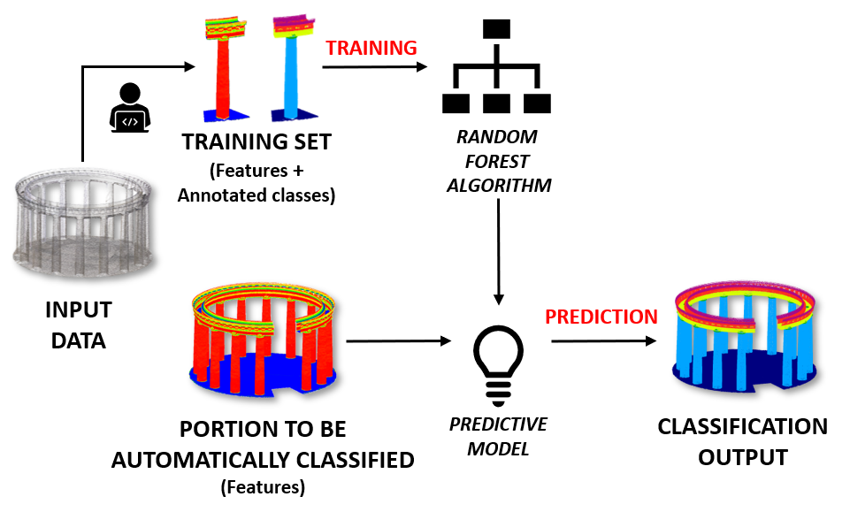
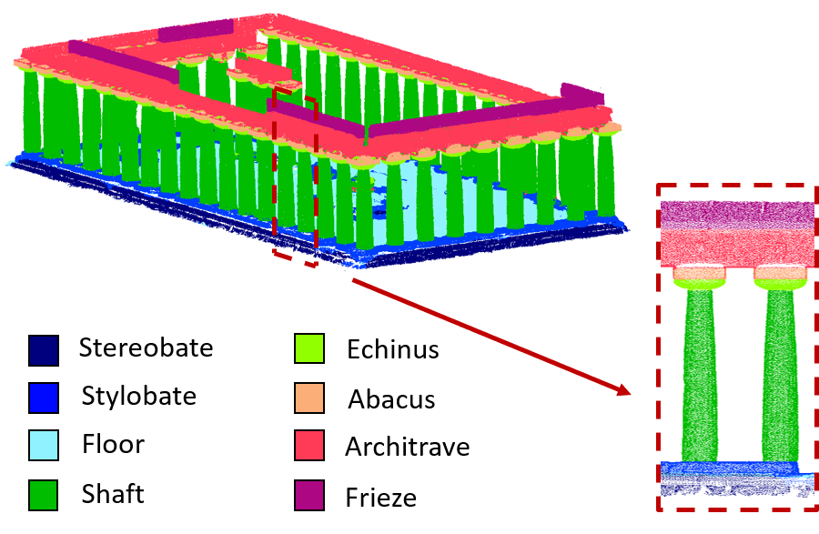
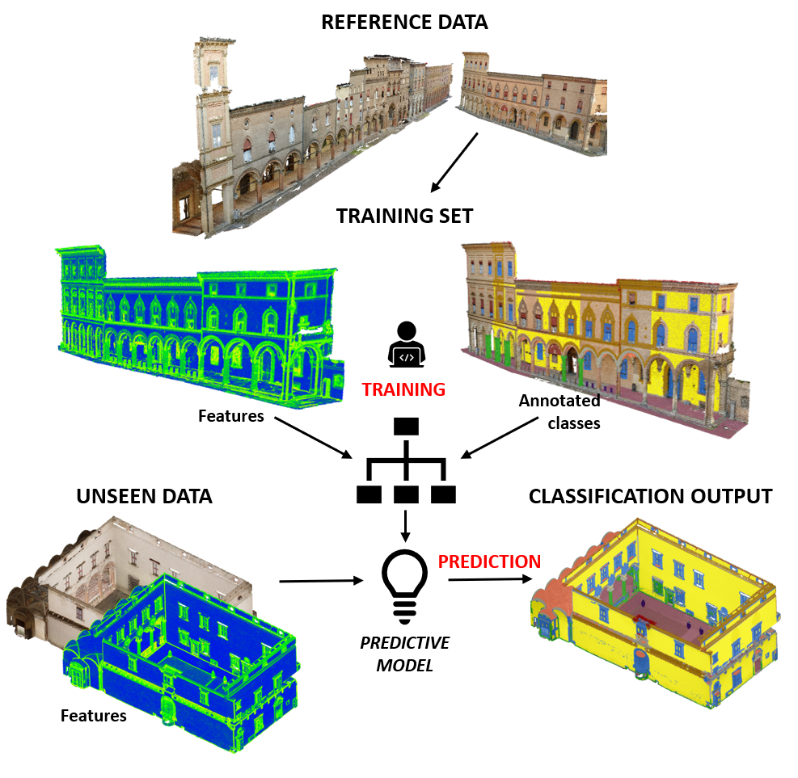

# **Random Forest 4 Point Cloud Classification - RF4PCC**
The following code has been developed, starting from the scikit-learn libraries, in order to supervisly classify 3D point clouds. 

## **Developer Contributors**

- Alessandro Torresani

### **Other contributors**

- Eleonora Grilli
- Fabio Remondino

Grilli, E., Farella, E. M., Torresani, A., and Remondino, F.: GEOMETRIC FEATURES ANALYSIS FOR THE CLASSIFICATION OF CULTURAL HERITAGE POINT CLOUDS, Int. Arch. Photogramm. Remote Sens. Spatial Inf. Sci., XLII-2/W15, 541–548, https://doi.org/10.5194/isprs-archives-XLII-2-W15-541-2019, 2019.

Grilli, E.; Remondino, F. Machine Learning Generalisation across Different 3D Architectural Heritage. ISPRS Int. J. Geo-Inf. 2020, 9, 379. https://doi.org/10.3390/ijgi9060379

## **Dependencies**
Python3 and Scikit-learn

## **Requirements** 
### 1.  **Training file:** a portion of your point cloud with associated geometric and/or radiometric features and a class index (coming after the manual annotation)
### 2. **Evaluation file:** another portion of the point cloud with the same features in the same order and again the manually annotated class index (the classifier will use this file to evaluate the performance of the classification).
### 3.  **Test file:** the rest of your dataset with the same features, in the same order
### 4.  **Feature and class index file:** create a two-lines file, the first line is dedicated to the column index of the features that you are using, the second line is for the column which contain the class index.

   For example,considering the following distribution of the point cloud columns 
   ### x y z r g b f1 f2 f3 class_index 
   ### if you want to use f1 f2 f3 as features the txt file will be :  
   Line_1: 6 7 8 	
  
   Line_2: 9

All the files have to be save in **.txt** format, and **without header** (Training, Evaluation and Test set) 

## **How to run** 
After you have prepared the aforementhioned files, collect them in a folder together with the train.py and classify.py files. 

At a command prompt run:

>$ python train.py feature_path training_path evaluation_path n_core file_to_save_name

This should result in the creation of:
-  your classifier model **.pkl**. The name of this file will be related to the number of random trees that performed the best classification (i.e. ne50none.pkl). 
- a new .txt file containig the evaluation dataset with a new column with the predicted classes 

To extend the classification to the test dataset at a command prompt run:

> $ python classify.py feature_path classifier_path test_path file_to_save_name

This should result in the creation of your test file classified (the predicted classes are saved as last column after the features)

## **Dataset for testing the code**

If you want to rapidly test our classification code on a heritage case study you can download the four aforementhioned datasets from this [Google drive folder](https://drive.google.com/drive/folders/1z-f-QfzgEkjsMrdwCsBll0PcqNs6EGYr?usp=sharing) 

## **Pretrained models**

Refering to the following article: 

Grilli, E.; Remondino, F. Machine Learning Generalisation across Different 3D Architectural Heritage. ISPRS Int. J. Geo-Inf. 2020, 9, 379.  https://doi.org/10.3390/ijgi9060379

you can find and **try our pre-trained models** for architectural classification at this [Google drive folder](https://drive.google.com/drive/folders/1ndjppIBDixGM-Liq8dPH97XKYTSBpwzW?usp=sharing)

## **Citation**

If you decide to try our code or trained models we would be please if you cite us: 

> Grilli, E.; Remondino, F. Machine Learning Generalisation across Different 3D Architectural Heritage. ISPRS Int. J. Geo-Inf. 2020, 9, 379.
